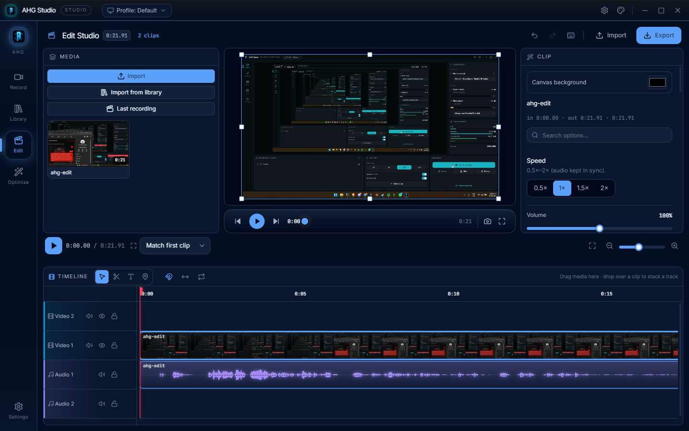
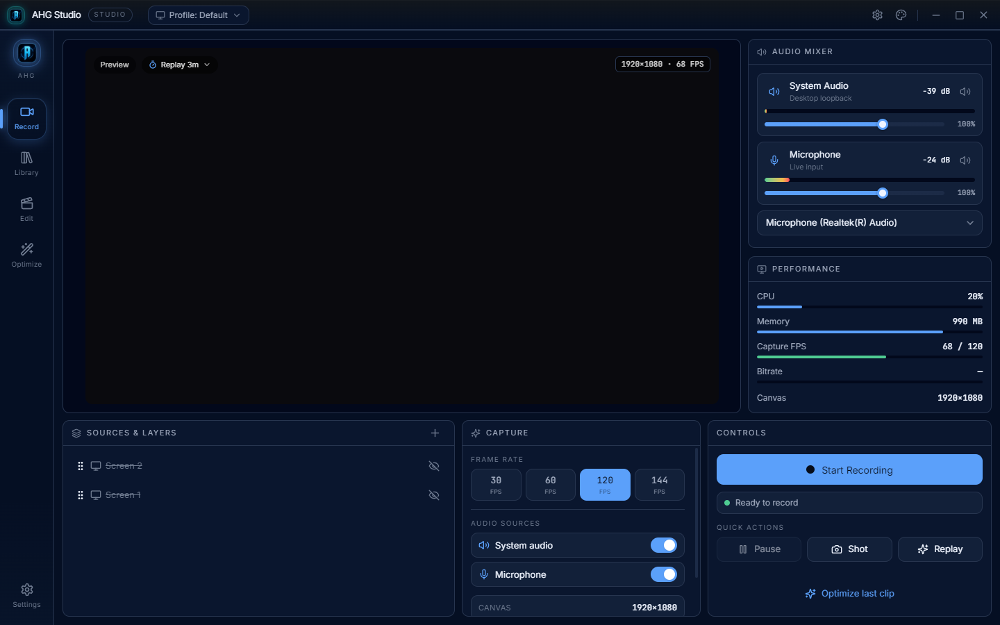
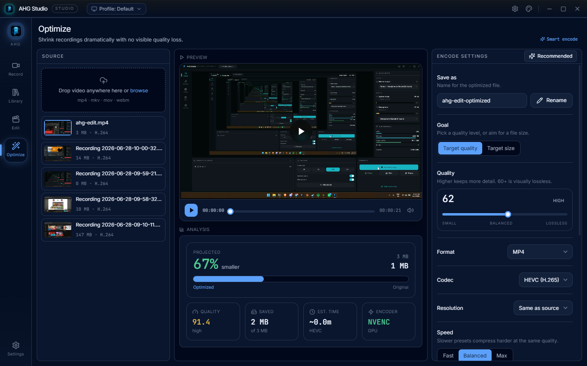
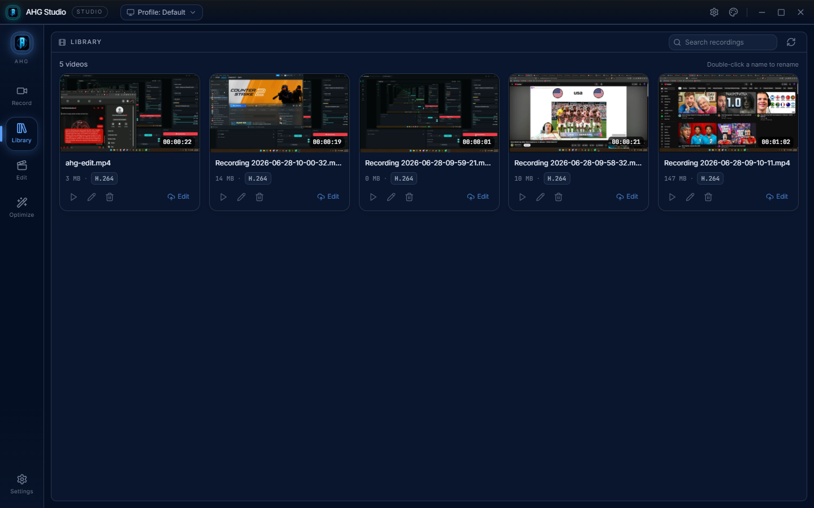

# AHG Studio

A premium, all-in-one **screen recorder**, **video optimizer**, and **multi-track video editor** for the desktop. Built with Electron + React + TypeScript, with **FFmpeg bundled inside** so it works with no extra setup.

Record your screen with system audio, trim and edit on a real timeline (transitions, keyframed motion, blend modes, text, audio mixing), then export, or shrink any recording hard with GPU-accelerated encoding, all in one app.



> Windows is the primary, tested target. macOS/Linux are not yet packaged.

## Download

**[⬇ Download the latest Windows build](https://github.com/sinfoo/ahg-studio/releases/latest)** — grab `AHG-Studio-vX.Y.Z-win-x64.zip`, extract it, and double-click `AHG Studio.exe`. No installer, FFmpeg is bundled. (Windows SmartScreen may warn on the unsigned build, click **More info → Run anyway**.)

Prefer to build it yourself? See [Quick start](#quick-start) below.

## Features

- **Record** — captures the screen with system audio via Electron `getDisplayMedia` (no OS picker), webcam / window / image / text sources, an OBS-style audio mixer, and configurable GPU encoders up to 144 FPS. Saved to `Videos/AHG Studio/`.
- **Edit** — a full multi-track timeline: drag-and-drop media, ripple trim, split, markers, 20+ transitions, per-clip color / blur / vignette / sharpen, opacity & blend modes, picture-in-picture with keyframed motion, a per-clip audio mixer (gain / EQ / compressor / pan), text with gradients and outlines, and a single-canvas compositor preview. Export to MP4/MKV/MOV/WebM (H.264 / HEVC / AV1) or to an editable `.mlt` (Shotcut) project.
- **Optimize** — real compression through bundled FFmpeg (H.264 / HEVC / AV1, quality or target-size, optional downscale) with GPU encoders (NVENC / QuickSync / AMF) auto-detected, live progress, and before/after compare.
- **Library** — a premium grid of your recordings with rename, delete, batch select, a built-in video player, and one-click import to the editor.
- **Settings** — output folders, capture (resolution / FPS / encoder / audio), hotkeys, themes (dark / light / midnight / graphite / aurora), and startup options.

## Screenshots

| Record | Optimize |
| --- | --- |
|  |  |
| **Library** | **Edit** |
|  |  |

## Quick start

```bash
npm install
npm run dev          # web dev server at http://localhost:5180
```

If `npm install` reports a blocked install script (esbuild):

```bash
npm approve-scripts esbuild && npm rebuild esbuild
```

### Run as a desktop app (live dev)

```bash
npm run electron:dev   # Vite + Electron with hot reload
```

### Build a Windows app

```bash
npm run package:win
```

Produces a portable build at `release/AHG Studio/AHG Studio.exe`. Copy that
`release/AHG Studio` folder anywhere and double-click the `.exe`. FFmpeg is bundled, so there is no install step.

> For a single self-contained `.exe`, enable Windows **Developer Mode** (Settings → Privacy & security → For developers) and run `npm run dist` (electron-builder needs symlink permission).

## Tech stack

Electron (main process: `electron/main.cjs`), React 18 + TypeScript + Vite (renderer), Tailwind CSS, framer-motion, lucide-react, and FFmpeg via `ffmpeg-static` / `ffprobe-static`.

## Project structure

```
electron/
  main.cjs             Electron main process: window, IPC, FFmpeg export/optimize/probe
  preload.cjs          context-isolated bridge
src/
  App.tsx              shell, page routing, keep-alive, theme
  pages/
    Record.tsx         recording studio (preview, audio mixer, sources & layers)
    Edit.tsx           multi-track timeline editor + inspectors + export
    Optimize.tsx       compression studio with before/after compare
    Library.tsx        recordings grid + video player
    Settings.tsx       output / capture / encoder / hotkeys / themes
  components/          PreviewPlayer (compositor), overlays, color picker, UI kit
  hooks/               useCapture, useGridSelect, CaptureContext
  store/               settings, optimize, export, library (external stores)
  lib/                 timeline model, formatters, thumbnails, notify, FFmpeg bridge types
docs/                  PRODUCT.md (audience & principles), DESIGN.md (tokens)
```

## Contributing

Issues and pull requests are welcome. Before opening a PR:

```bash
npm run build        # type-check (tsc --noEmit) + production build must pass
```

Keep changes focused, match the existing code style, and describe what you changed and why.

## License

[MIT](LICENSE) © AHG Studio.

### A note on FFmpeg

This project bundles FFmpeg binaries via `ffmpeg-static` (and `ffprobe-static`). FFmpeg is licensed under the **LGPL/GPL** depending on its build; `ffmpeg-static` ships GPL builds. The AHG Studio source code is MIT, but if you **redistribute the packaged application** (the `.exe`, which contains FFmpeg), your distribution must also comply with FFmpeg's license. See [ffmpeg.org/legal](https://ffmpeg.org/legal.html).
